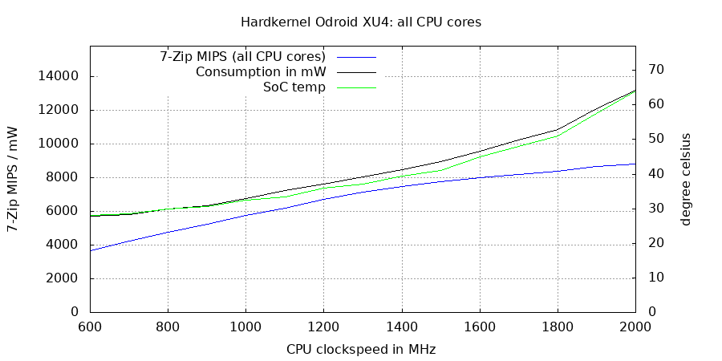
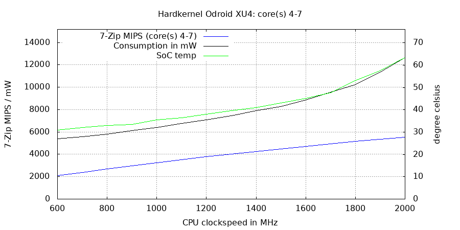
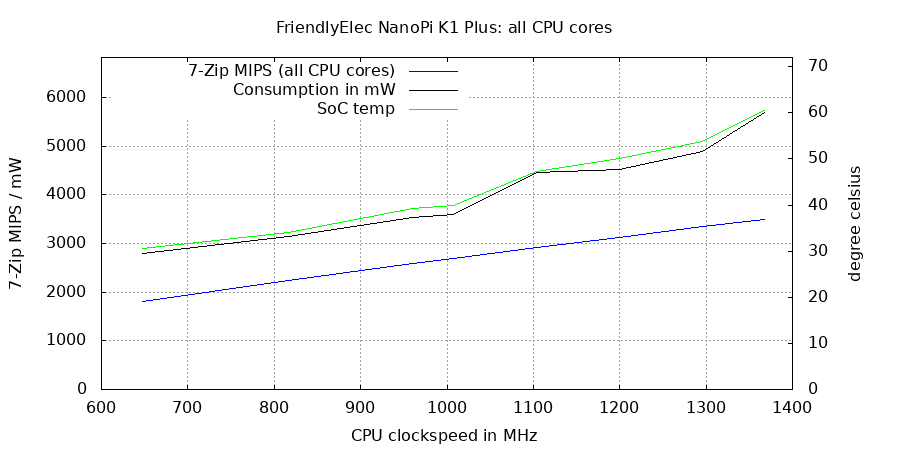

# Efficiency graphing

As of v0.8.2 there's the `-p` option to draw efficiency graphs. With v0.8.3 came support for [Netio powermeters](https://www.netio-products.com/en) to also monitor the power the whole setup (device including wall wart) needs in which situation.

Of course this is a bit flawed since the powermeter's accuracy is an issue and the efficiency of the wall wart / charger used. Also my own measurements are affected by the fact that majority of my SBC were early developer samples and as such idle consumption might differ with later production revisions that were/are on sale.

## Use cases

### Balanced performance vs. consumption

What is this for? It's about efficiency. Running benchmarks implies tuning the system for maximum performance but that's not always the desired outcome. Thinking of battery powered systems or when consumption is a general issue it might be interesting to find the 'sweet spot' where energy consumption and performance are well balanced.

SoCs implementing big.LITTLE (combining fast and efficient cores) tend to become very inefficient at higher clockspeeds. This is an ODROID-XU4 relying on a Samsung Exynos 5244 with four slow A7 cores and also four fast A15 cores. When all cores are busy walking through the cpufreq OPP (operating points) both consumption and performance scale almost linearly up to 1400 MHz but afterwards consumption increases massively while performance gains are close to negligible:

The little A7 cores remain at 1.4GHz while the big A15 cores need an ever increasing Vcore voltage to operate stably at higher clockspeeds (DVFS at work – dynamic voltage frequency scaling). Let's look at the recorded raw data:

    Sysfs/Tested:  MIPS / Temp /  Watt
     500 /  500 :  3093  35.5°C  5510mW
     600 /  600 :  3660  28.0°C  5715mW
     700 /  700 :  4221  28.5°C  5825mW
     800 /  800 :  4765  30.0°C  6140mW
     900 /  900 :  5247  30.5°C  6345mW
    1000 / 1000 :  5768  32.5°C  6755mW
    1100 / 1100 :  6223  33.5°C  7230mW
    1200 / 1200 :  6729  36.0°C  7620mW
    1300 / 1300 :  7142  37.0°C  8040mW
    1400 / 1400 :  7498  39.5°C  8495mW
    1500 / 1500 :  7777  41.0°C  8960mW
    1600 / 1590 :  8033  45.0°C  9575mW
    1700 / 1700 :  8204  48.0°C 10265mW
    1800 / 1790 :  8376  51.0°C 10870mW
    1900 / 1900 :  8690  57.5°C 12125mW
    2000 / 2000 :  8828  64.0°C 13195mW

By looking at the graph it becomes obvious that efficiency gets worse when exceeding 1.4 GHz. At this clockspeed all 8 cores score 7500 7-ZIP MIPS at 8.5W. When the big cores are allowed to clock up to 2.0 GHz we're talking about about an 18% performance gain while needing 55% more juice. When looking only at the big cores it's the same picture:

At around 1.5 GHz the cores become more and more inefficient since the amounts of energy needed to let them operate stably at higher clockspeeds grow somewhat exponentially.

    Sysfs/Tested:  MIPS / Temp /  Watt
     500 /  500 :  1776  29.0°C  5125mW
     600 /  600 :  2101  31.0°C  5390mW
     700 /  700 :  2392  32.0°C  5595mW
     800 /  800 :  2699  33.0°C  5795mW
     900 /  900 :  2973  33.5°C  6115mW
    1000 / 1000 :  3246  35.5°C  6415mW
    1100 / 1100 :  3518  36.5°C  6740mW
    1200 / 1200 :  3770  38.0°C  7060mW
    1300 / 1300 :  4029  39.5°C  7440mW
    1400 / 1400 :  4248  41.0°C  7910mW
    1500 / 1500 :  4495  43.0°C  8280mW
    1600 / 1600 :  4713  45.0°C  8880mW
    1700 / 1700 :  4943  47.5°C  9545mW
    1800 / 1800 :  5161  53.0°C 10255mW
    1900 / 1900 :  5363  57.5°C 11320mW
    2000 / 1990 :  5522  63.5°C 12640mW

At 1.4 GHz the big cores alone score 4250 7-ZIP MIPS at ~8W. At 2.0 GHz performance increased by 23% but consumption by 60%. The sweet spot obviously is somewhere around 1.4/1.5 GHz.

For this type of comparison we also need to take care of the device's idle consumption which in this (and unfortunately in many/most cases with SBC) is awfully high: almost 4W when doing nothing (though this is not an ODROID XU4 but it's large NAS sibling HC2 having an USB2SATA bridge and some additional DC-DC cirtcuitry on the PCB).

### Spotting DVFS anomalies

This is a NanoPi K1 Plus using an Allwinner H5 consisting of four Cortex-A53 made in 40nm. This chip being rather inefficient in general also shows a weird consumption/thermal curve when walking through the DVFS OPP:

There's clearly something wrong with settings since the tiny increase of just 96MHz between the 1008MHz and 1104MHz OPP results in a whopping 300mW consumption difference:

    Sysfs/Tested:  MIPS / Temp /  Watt
     480 /  480 :   380  24.7°C  1906mW
     648 /  650 :   500  25.8°C  1996mW
     816 /  820 :   614  26.7°C  2150mW
     960 /  960 :   707  29.2°C  2343mW
    1008 / 1010 :   737  29.7°C  2400mW
    1104 / 1110 :   796  32.7°C  2696mW
    1200 / 1200 :   854  33.7°C  2676mW
    1296 / 1300 :   910  34.6°C  2803mW
    1368 / 1370 :   950  37.3°C  3090mW

Kernel is Armbian's 5.10.60-sunxi64. Time to look which DVFS OPP are defined there...

(Work in progress, to be continued)

### Cortex-A53

| Board | idle mW | cpu0 400MHz | cpu0 1400MHz | cpu0-3 400MHz | cpu0-3 1400MHz |
| ----- | :--------: | ----: | ----: | ------: | ------: | -----: |
| NanoPi Fire3 (S5P6818) | 2390 | 196 | 743 | 363 | 2006 |
| Rock64 (RK3328) | 1820 | 396 | 1060 | 763 | 2446 |
| PineH64 (H6) | 2380 | 183 | 620 | 450 | 1453 |
| NanoPi NEO4 (RK3399) | 2140 | 176 | 580 | 276 | 1346 |
| RockPro64 (RK3399) | 3070 | 126 | 640 | 243 | 1430 |
| NanoPi K1 Plus (H5) | 1570 | 336 | 1520 | 993 | 4113 |

325 999 1284 3838
340 1032 1202 3696
333 1028 1200 3745
341 1026 1262 3668
341 1013 1269 3617
317 970 1143 3562

400, 1000, 1400

### Cortex-A7

| Board | idle mW | SoC | 500MHz | 1300MHz | 500MHz | 1300MHz |
| OrangePi PC | 1740 | H4 @ 40nm | 153 | 716 | 476 | 1673
| ODROID-HC2 | 3890 | Exynos 5422 | 260 | 505 | 515 | 1305

314 800 1112 2826
299 661 1212 2593